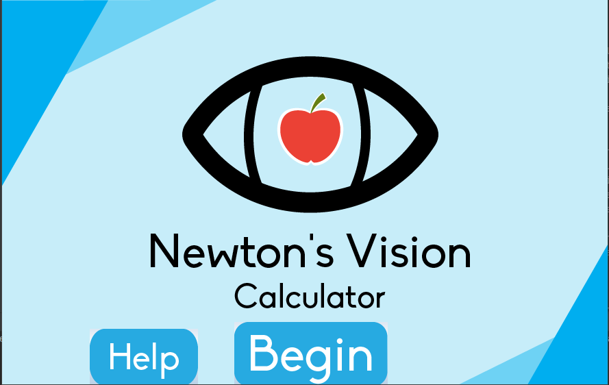
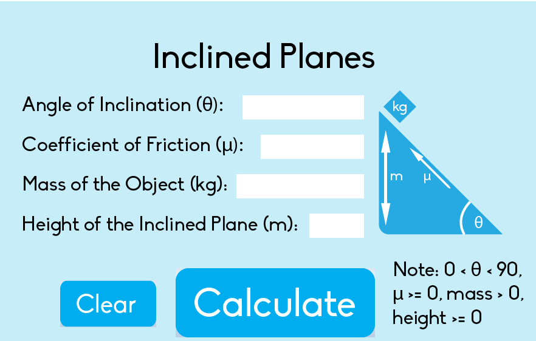
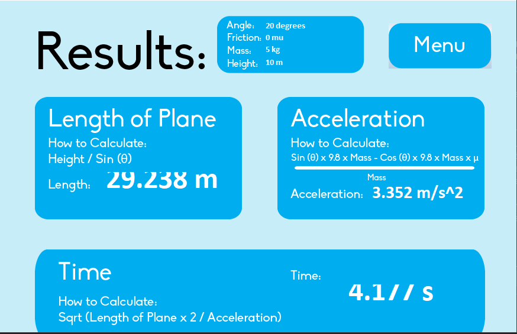

# Newton's-Vision
**High School Computer Science Project**

This application demonstrates and calculates aspects and concepts of Dynamics.

Dynamics is a branch of Classical/Newtonian Mechanics that is focused on the study of forces and its effects on motion.

The two concepts explained are:

1) Inclined Planes.
This concept revolves around objects placed at the top of an inclined surface, such as a ramp. 
Objects will attempt to slide down the ramp as a result of gravity. 
The effects are simulated and information regarding the concept is calculated.
- The user will input values related to the length of the plane, the inclining angle, mass of the object and friction (if applicable).
- The program will then simulate, calculate and display values related to the acceleration and time it takes to reach the bottom.

2) Projectile Motion.
This concept revolves around objects being shot into the air with an initial velocity.
Objects will be suspended in the air until brought down as a result of gravity (the only force applied on the object [free fall])
The effects are simulated and information regarding the concept is calculated.
- The user will input values related to the initial velocity, the inclining angle, and initial height(if applicable).
- The program will then simulate, calculate and display values related to the max height, distance traveled and time suspended.

This program includes a main menu, a help screen (providing instructions as to how to operate), a selection screen,
input locations, a simulation and lastly a display of the calculations.
___
This application was built using object oriented principles to modularize code.

It uses the Javaswing library and paint functions to implement graphics.
___

